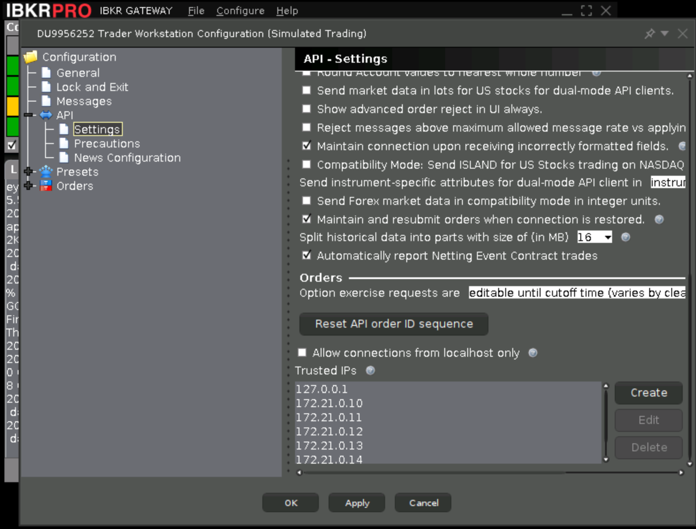

# Algo Trader for IB

## 项目简介
Algo Trader 是一个围绕 Interactive Brokers 网关构建的自动化量化交易平台后端雏形。当前仓库聚焦于后端基础能力的搭建：使用 FastAPI 作为网关框架，整合日志、Redis 消息总线、内存队列、数据库访问层以及策略运行时配置等模块，为后续拆分服务与前端可视化奠定基础。

## 当前功能模块
- **FastAPI 主程序**：`src/server` 提供 `create_app()` 工厂、生命周期管理、认证中间件、WebSocket 集线器及健康检查、文档聚合等路由，能够在启动阶段统一初始化日志、Redis、数据库与内部队列资源。
- **配置管理**：通过 `AppSettings` 支持从环境变量加载应用元信息、CORS、JWT、托管子服务与 WebSocket 通道配置，便于在 `.env` 或部署环境中集中控制行为。
- **统一日志**：`src/app_logging` 实现结构化 JSON 日志、按天滚动、`request_id` 上下文绑定与控制台输出开关，可在任意服务中一致化记录关键事件。默认过滤 IB API 取消订阅错误（代码 300，消息 “Can't find EId”），避免噪声干扰定位真实问题。
- **Redis 客户端封装**：提供 `RedisSettings`、`RedisClientManager` 与 `PubSubChannel`，涵盖连接初始化、健康检查、JSON 序列化及发布/订阅封装，方便与消息总线集成。
- **内存任务队列**：`src/queue_manager` 包含可见性超时、指数退避重试与异步 Worker 封装，支持后续订单、风控等子服务调度任务。
- **数据库访问层**：`src/database` 提供基于异步引擎的会话工厂、仓储基类、初始化/迁移工具，当前默认以 SQLite 适配单元测试，未来可切换到 MariaDB。
- **Parquet I/O**：`src/parquet_io` 封装 PyArrow Schema 校验、分区写入与区间读取，支持将历史行情落盘至 `data/` 目录。
- **策略运行时配置**：`src/strategy` 定义策略时间窗与周末跳过逻辑，可序列化导出/更新，为策略服务提供统一的调度规则。
- **IB 连接封装**：`src/ib` 提供 Gateway 配置数据类、会话租约注册表、带重连/主备切换的异步连接管理器以及 `IBServiceClient` 模板，帮助订单、行情等服务便捷地获取并释放稳定的 IB API 会话，并通过模拟工作负载测试验证多租约并发与主备故障切换能力。

## 使用 Docker 镜像一键运行

- 进入 `public` 目录并执行：
  - `bash ./setup_and_run.sh`

- 脚本能力：
  - 自动复制 `middle/.env.example` 与 `public/.env.example` 为 `.env`
  - 交互输入并写入：`TWS_USERID`、`TWS_PASSWORD`、`VNC_SERVER_PASSWORD`、`REDIS_PASSWORD`、`MARIADB_PASSWORD`
  - 启动基础设施：`ib-gateway`、`redis`、`mariadb`
  - 在 MariaDB 就绪后创建数据库与用户：`algo_trader`，并导入 `public/mariadb_init.sql`
  - 更新 `public/.env` 中的 `REDIS_URL` 与 `MARIADB_URL`
  - 启动所有服务容器（前后端）：`docker compose -f public/docker-compose.yml up -d`

## 安装后初始化

- 首先，通过VNC客户端连接到Docker容器的桌面环境。默认端口为5900，密码为`VNC_SERVER_PASSWORD`。点击菜单Configure-Settings，打开IB Gateway的设置界面。按下图中反选Allow connections from localhost only，然后点击Create按钮添加6个IP：172.21.0.10-172.21.0.15。最后，点击OK保存。

- 其次，打开网页：http://localhost:5173/。点击策略面板的添加按钮，添加新的策略，当前版本已经带了两个策略模板的例子：
1. Mean Reversion Strategy： 订阅1/5m k线数据，基于均值反转理论，成交频率是分钟级。
2. Dom Structure Strategy： 订阅DOM数据，计算obi、ofi、cvd等市场数据指标，判断短时间内的趋势方向，成交频率可达1分钟内。
* 注意：k线数据和DOM数据，都需要在IB账号中开启对应的订阅。