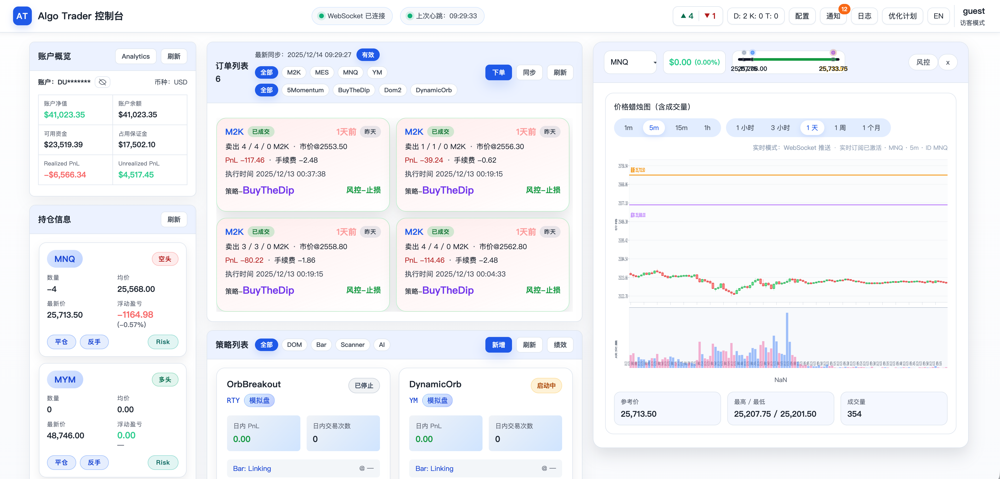
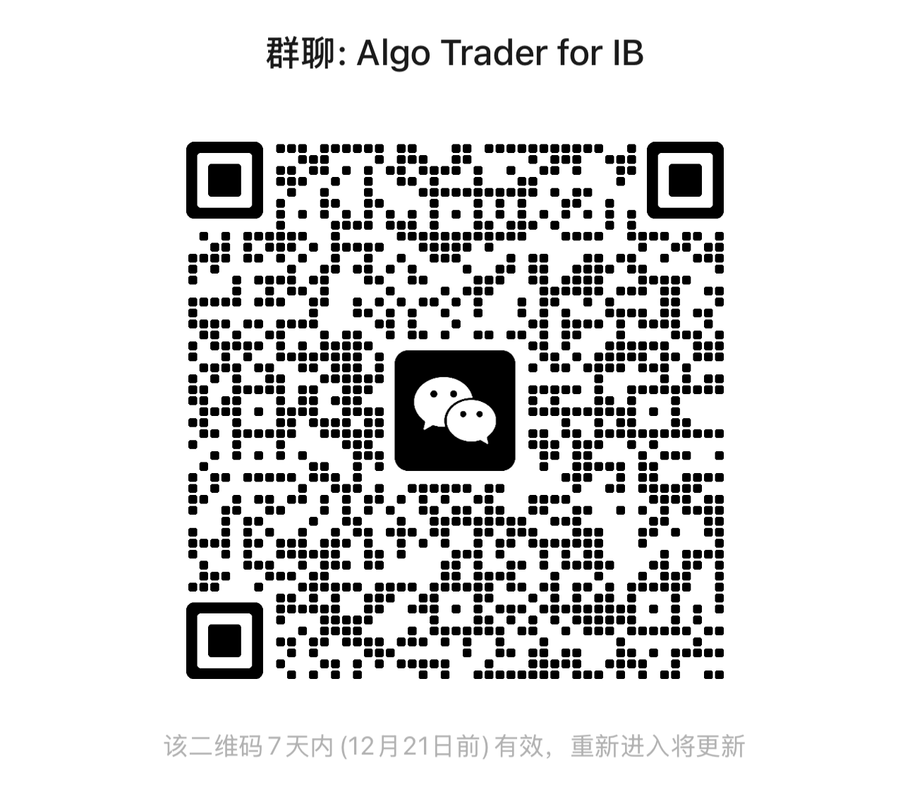

# Algo Trader for IB



## 项目简介

Algo Trader for IB 是一个围绕 Interactive Brokers (IB) 网关构建的自动化量化交易平台后端雏形。当前版本聚焦于后端基础能力的搭建：采用 FastAPI 作为服务网关框架，整合统一日志、Redis 消息总线、内存任务队列、数据库访问层以及策略运行时配置等模块，为后续拆分微服务架构与前端可视化奠定基础。

## 技术架构

Data 等子服务，实现账户管理、订单执行、行情数据等功能。各服务通过 Redis 进行服务注册和消息通信，并共享 MariaDB 数据库存储持久数据。同时，通过 IB Gateway 与真实交易市场交互，提供实时行情和交易执行能力。

## 路线图 (Roadmap)

- 短期目标：丰富策略支持和回测能力。即将引入更多内置策略类型，包括市场扫描策略、AI 模型驱动策略等，并完善历史数据回测框架，方便用户在模拟环境中验证策略表现。

- 中期规划：实现策略托管发布和交易策略市场。允许优秀的策略在平台上共享和交易，建立策略开发者与投资者之间的桥梁，形成生态闭环。与此同时，逐步补全账户、订单、风控等独立服务模块，打通从数据获取、策略决策到执行反馈的全流程。

- 长期展望：扩展支持更多交易接口和资产类别，在目前对接 IB 美股/期货的基础上，增加对数字资产交易所等平台的支持（已有 OKX 子项目的实践经验） 。通过插件化架构适配不同市场和数据源，提升系统通用性。继续优化性能和稳定性，完善监控和安全机制，努力将 Algo Trader 打造成一个业界领先的开源量化交易平台。

## 前置条件

在部署和运行 Algo Trader for IB 之前，请确保具备以下环境和账户准备：

- IB账户及网关：您需要拥有一个有效的 Interactive Brokers 账户，并已在账户中开通相应的市场数据订阅权限（例如美股 Level I 实时行情、期货行情、深度数据等，取决于策略需求）。如果本地已占用IB Gateway默认端口4002或数据库端口3306，需调整配置避免冲突。

- 软件依赖：主要就是docker环境。所有必要的依赖服务（IB Gateway、Redis、MariaDB、前后端服务）都会通过Docker自动部署。如需自行运行源码，需Python 3.11+环境，但一般无需本地安装Python。

## 安装

1. 获取代码：克隆或下载本项目代码仓库，并进入项目目录：
```
git clone https://github.com/winglight/algo-trader-ib.git

cd algo-trader-ib
```

当前仓库已包含部署所需的一切文件，包括Docker Compose配置、启动脚本等。

2. 运行安装脚本：执行提供的一键部署脚本，启动所有组件：
```
./setup_and_run.sh
```
3. 根据提示输入IB账户（仅支持Paper账号）密码及vnc、redis、mariadb的秘码。

整个初始化过程完成后，控制台会输出 “完成：中间件与服务容器已启动” 等提示信息 。您可以通过`docker compose ps `查看正在运行的容器列表，通过 `docker compose logs -f backend `等命令实时查看某服务日志。如果需要停止服务，执行 `docker compose down `即可停止并移除容器。

## 快速开始
1. 安装后设置：首次部署完成后，需要进行一次IB Gateway的设置及策略添加

2. 配置 IB 网关访问：由于IB Gateway默认仅允许来自本机的API连接，我们需要授权平台容器的连接。使用VNC客户端连接到IB Gateway容器的桌面界面（Docker已将容器的5900端口映射为本地5900，使用您在脚本中设置的VNC_SERVER_PASSWORD进行连接）。打开IB Gateway的“Configure -> Settings”设置窗口，找到 API -> Settings。将 “Allow connections from localhost only” 前的勾选取消，然后点击旁边的 Create 按钮，添加以下六个IP地址段： 172.21.0.10 至 172.21.0.15 （这六个IP对应平台各服务容器在Docker内部网络中的地址）。添加完成后点击 OK 保存设置。此操作允许平台的各服务通过内部网络访问 IB Gateway 的API接口，否则它们会被视为远程连接而遭拒绝。


3. 添加示例策略：
完成IB Gateway配置后，在浏览器中访问平台前端：打开 http://localhost:5173/。进入Web界面后，导航到“策略”面板。点击“添加”按钮，可以新建一个策略实例。目前版本内置了两个示例策略模板：

  - Mean Reversion Strategy（均值回归策略）：订阅1分钟和5分钟周期的K线数据，基于均值回归理论判断买卖信号，预期交易频率为分钟级别 。

  - DOM Structure Strategy（DOM结构策略）：订阅逐笔盘口（DOM）数据，计算Order Book Imbalance (OBI)、Order Flow Imbalance (OFI)、累计成交量差 (CVD) 等市场深度指标，用于研判短期内的趋势方向，交易频率可达到每分钟多次 。

 在添加策略时，可选择以上模板并填写具体参数（如交易标的、下单手数等）。策略添加后，系统会自动启动策略服务，订阅相应的实时数据并按策略逻辑进行下单交易。

* 注意: 上述示例策略涉及到K线行情和DOM深度行情，在使用前请确认您的IB账户已经订阅了相关的市场
数据权限，否则策略将无法收到所需的数据 。例如，美股/期货的实时行情数据、深度行情数据需要IB开户时另行订阅。如果未订阅，您可以在IB账户管理界面购买订阅相应数据，或在策略配置中避免使用权限的数据源。

4. 验证运行：策略启动后，可在前端仪表盘查看各模块的实时状态。例如：
* 在“订单”页面查看策略产生的挂单/成交记录更新；
* 在“日志”页面实时跟踪策略的日志输出（日志会标记所属服务和时间）；
* 在“系统状态”页面查看各服务的在线状态和接口文档聚合情况（API文档页面可验证服务是否正常对外提供REST接口）。


如果一切正常，至此您已经成功部署并运行了 Algo Trader 平台！策略将根据设定自动进行交易，您可以通过前端随时监控和管理。

## 常见问题解答 (FAQ)

- Q: 无法连接 IB Gateway 或策略提示连接错误怎么办？

- A: 首次运行后如果策略无法连接IB Gateway，请检查IB Gateway的API访问设置是否正确配置。特别是确保已按照上述步骤关闭了“仅允许localhost连接”的限制，并添加了容器内部IP地址段。如未执行，此限制会导致平台容器的连接请求被拒绝。另外，确认您提供的 TWS_USERID 和 TWS_PASSWORD是否正确无误。如果IB Gateway容器未能登录（例如密码错误或账户有双重验证），策略将无法获取行情和下单。您可以通过 VNC 查看IB Gateway界面，确认是否有登录失败的错误提示。如有，需要更新正确的账户凭据并重启容器。

- Q: 前端页面没有显示实时行情或策略无交易输出？

- A: 如果前端仪表盘中看不到行情数据或者策略没有产生预期的交易，请首先确认IB账户已经订阅了相应的市场数据权限（实时行情/深度行情等）。没有权限时，IB会返回错误或不给数据 。您可以在日志页面查看Market Data服务的日志是否有关于权限的错误信息。如果是权限问题，需在IB账户管理中订阅所需的数据。另外，检查Market Data服务是否正常运行（系统状态页中服务是否Online），以及策是否处于运行状态且未触发风控停止。策略逻辑本身的判断可能需要一定条件才会下单，短时间不交易也可能是正常现象。

- Q: Docker 容器无法启动/异常退出怎么办？

- A: 如果执行部署脚本后有容器无法正常启动，可能的原因包括:

    - 端口冲突：默认情况下IB Gateway使用4002端口、Redis使用6379端口、MariaDB使用3306端口、前端使用5173端口、后台API使用8000端口。如果您的主机上这些端口已被占用，相关容器可能会启动失败。您可以修改项目目录下的 .env 或 docker-compose.yml 中相应的端口映射配置。例如将8000:8000 改为 8001:8000 等，然后重新启动。

    - 旧数据影响：如果之前运行过本项目，再次运行时可能遇到数据库初始化冲突。例如MariaDB容器检测到已有数据卷且root密码不同，会跳过创建用户步骤。这种情况下，建议删除 data/mariadb 目录后重新运行脚本，或手动进入数据库容器调整用户权限。Redis 如有遗留数据也可以清空 data/redis 目录。清理数据卷后重试通常可解决问题。

    - 镜像下载失败：部署脚本需要从互联网下载所需Docker镜像。如果网络不稳定，可能出现拉取镜像超时或失败。请检查主机的互联网连接，必要时多运行几次脚本或手动使用 docker pull <image> 拉取失败的镜像。镜像全部就绪后，再次运行脚本。

- Q: 如何修改配置参数比如连接信息或策略参数？

- A: 平台的大部分配置通过环境变量定义，存放在项目根目录的.env文件和 config/ 子目录下各服务的env文件中。您可以编辑这些文件以修改配置。例如：

    - 修改 IB 网关主机/端口：在  .env  中调整  IB_GATEWAY_HOST  和  IB_GATEWAY_PORT （默认分别为127.0.0.1和4002）。如IB Gateway部署在其他机器，可将HOST改为对应IP并确保网络可达。

    - 修改 数据库/Redis 连接：在  .env  中调整  REDIS_URL  或  MARIADB_URL  指向新的地址或凭据。如果您想使用外部数据库而非Docker内置的，可以在这里配置相应连接串。

    - 调整 策略风控参数：如需要修改全局止损比例、单笔风险值等，可以在  .env  中调整 STOP_LOSS_RATIO 、 RISK_PER_TRADE_R 等参数。这些参数会在策略运行时生效，从而改变策略的风控行为。

    - 修改配置文件后，重启相关服务容器以使更改生效（可以通过 docker compose restart <服务名> 或干脆docker compose down && docker compose up -d 重启整个栈）。注意：敏感信息（如密码）请妥善保管，避免明文出现在公共仓库或日志中。

- Q: 是否支持添加自定义策略代码？如何集成自己的策略？

- A: 支持。Algo Trader 平台非常适合扩展自定义策略。您可以将自己的策略逻辑封装为符合平台接口要求的python文件，然后通过挂载的方式集成：

    - 在开发模式下，您可以直接将策略脚本放入项目的  strategies/  目录（Docker Compose 已将宿主机的 ./strategies 挂载到容器内部的 /app/src/strategies）。然后在前端添加策略时选择“策略名称”并填写相应的策略类路径和参数，即可运行您的策略代码。

    - 默认提供的示例展示了策略如何订阅数据、获取配置并产生交易指令。您可以参考源码中的策略模板来编写自己的策略。如果遇到问题，可以查阅项目文档或在社区讨论区寻求帮助。

如果您在使用过程中遇到上述未涵盖的问题，欢迎在GitHub提交Issue或讨论。本项目将持续改进，期待您的反馈和贡献。祝您交易顺利！

项目讨论微信群：
