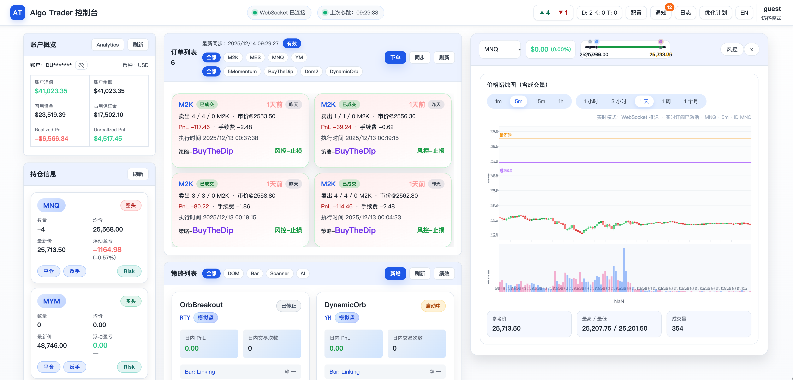
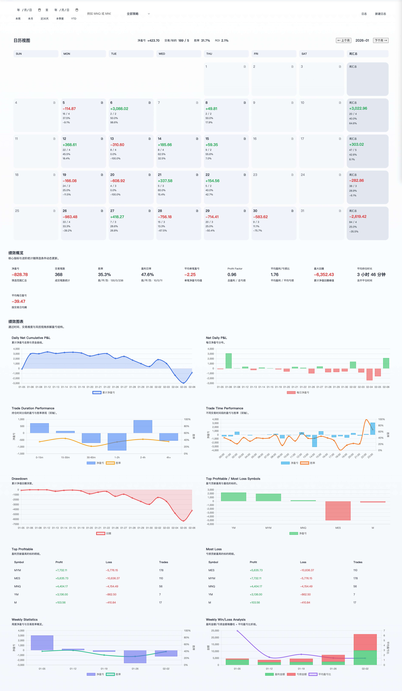

# ATI Local Runtime

[English Version](README_en.md)

ATI Local Runtime 是 Algo Trading Intelligence 的本地运行版。它把交易工作台、API、账户、订单、行情、风控、策略、仿真和策略规格服务打包为一套 Docker Compose 环境，适合在个人电脑或自有服务器上运行。

官方网站：[ati.broyustudio.com](https://ati.broyustudio.com)  
会员与产品页入口：[ati.broyustudio.com](https://ati.broyustudio.com)  
云端 Strategy Studio：[ati-studio.broyustudio.com](https://ati-studio.broyustudio.com)  
本地交易系统 Demo：[ati-trading.broyustudio.com](https://ati-trading.broyustudio.com)

本地版用于运行和验证自己的交易环境；云端 Studio 用于托管式 workflow 设计、云端试用和后续订阅能力。公开安装包不包含云平台服务、云端镜像、Agents、AI Model Ops、News 或私有平台代码。

首次安装后，本地环境在未绑定云平台用户前可试用 24 小时。绑定云平台用户后，本地服务会按云平台订阅等级下发的能力启用或禁用。



## 功能概览

- 本地交易工作台：浏览器访问 `http://127.0.0.1:5173`。
- Broker adapter 支持 `sim`、`ibkr_paper` 和 `alpaca_paper`；`sim` 始终安装，可同时启用多个 Paper profile。
- 核心服务完整运行：API、account、orders、market data、risk、strategy、simulation、strategy spec。
- 本地策略目录：`strategies/` 会挂载到容器中，便于查看示例和添加自定义策略。
- 数据持久化：`.env`、`middle/.env`、`data/`、`logs/` 都保留在本机；其中云端绑定状态与本机安装身份保存在 `data/license/`，更新镜像、重建容器或清理日志都不会要求重新绑定。
- 默认关闭后端 docs/redoc/openapi，默认不暴露后端、Redis、MariaDB 到宿主机公网端口。



## 一键安装

复制下面这一行到终端执行：

```bash
bash -c "$(curl -fsSL https://raw.githubusercontent.com/winglight/algo-trader-ib/main/scripts/install.sh)"
```

安装脚本会引导填写：

- Redis 密码
- MariaDB 密码
- Web 登录密码
- 是否启用 IBKR Paper 和 Alpaca Paper
- 初始使用的 adapter
- 如果启用 IBKR：IBKR Paper 用户名、密码和 IB Gateway VNC 密码
- 如果启用 Alpaca：Alpaca Paper API key、secret 和 `iex`/`sip` data feed

安装完成后打开：

```text
http://127.0.0.1:5173
```

默认登录账号：

```text
ati-guest
```

密码为安装时填写的 Web 登录密码。

## Broker profiles

`sim` 始终启用且不需要券商账号。`ibkr_paper` 会额外启动 `middle/docker-compose.yml` 中的 `ib-gateway` profile；`alpaca_paper` 不增加容器，安装器只在选择它时从固定 commit 和 checksum 构建本地 Broker Runner 派生镜像。

安装完成后可在顶部栏查看已安装 profile。切换动作受后端 gate 和确认流程控制。只有 watchdog 容器挂载宿主机 Docker socket，其他业务容器默认不挂载。

自动化安装必须通过权限为 `0600` 或 `0400` 的文件传入 secret，例如：

```bash
./setup_and_run.sh --non-interactive \
  --enabled-adapters sim,alpaca_paper \
  --initial-adapter alpaca_paper \
  --alpaca-data-feed iex \
  --redis-password-file /secure/redis \
  --mariadb-password-file /secure/mariadb \
  --admin-password-file /secure/web \
  --alpaca-api-key-id-file /secure/alpaca-key \
  --alpaca-secret-key-file /secure/alpaca-secret
```

明文 credential 命令行参数会被拒绝。可先加 `--dry-run` 验证候选配置；dry-run 不提交 env，也不启动容器。

## 管理命令

```bash
docker compose ps
curl -X POST http://127.0.0.1:8110/watchdog/actions/services/api/restart \
  -H 'Content-Type: application/json' \
  -d '{"reason":"operator_restart","source":"operator"}'
```

installer 首次整体创建可调用 Compose；运行后 backend、Broker Runner、业务服务和 frontend 的启停/重启
必须通过 watchdog action。`SERVICE_WATCHDOG_PORT` 默认在 loopback 发布为 `8110`，用于本机运维控制面，
不是业务或公网端口。`FRONTEND_PORT` 默认 `5173`；若安装时覆盖端口、network、container prefix 或 IB
Gateway 名称，installer 会把这些隔离参数持久化到 `.env`，后续 recreate 不会漂移回默认栈。

中间件在 `middle/` 下单独管理：

```bash
cd middle
docker compose ps
docker compose logs -f redis
docker compose logs -f mariadb
docker compose --profile ib logs -f ib-gateway
```

## 安全边界

- 默认使用 `latest` 公开镜像；如需固定到特定版本，可在 `.env` 中设置 `ATI_IMAGE_TAG`。
- 默认发布前端 `127.0.0.1:5173` 和本机 watchdog 管理端口 `127.0.0.1:8110`；watchdog 不得绑定公网地址。
- 默认不发布 Redis、MariaDB、后端 API 服务端口。
- 默认不启用云平台、云端 Studio、Agents、AI Model Ops 或 News 服务。
- 默认不把 Docker socket 挂载给业务容器；Docker socket 只挂载给 watchdog 容器，用于按配置重启业务容器，并在 `ib` 模式下控制 `ib-gateway`。
- 未绑定云平台用户时，本地环境只提供 24 小时试用；绑定后按云平台订阅等级控制本地服务能力。
- `.env`、`middle/.env`、`data/`、`logs/` 不应提交到公开仓库。

## 目录说明

- `docker-compose.yml`：本地应用服务。
- `middle/docker-compose.yml`：Redis、MariaDB，以及可选 IBKR Paper Gateway。
- `.env.example`：应用配置模板。
- `config/*.env.example`：各服务配置模板。
- `strategies/`：本地策略示例与自定义策略挂载目录。
- `algo_trader.sql`：本地数据库初始化 SQL。

## 更新

```bash
docker compose pull
docker compose up -d
```

如果使用 IB 模式：

```bash
docker compose --profile ib pull
docker compose --profile ib up -d
```

如果数据库结构变更，请先备份 `middle/data/mariadb`，再按发布说明迁移。

### 更新现有安装

显式使用 `--update` 更新已有安装。安装器会再次请求确认，随后先把 MariaDB
完整逻辑备份写入安装目录同级的 `ati-local-runtime-backups/update-<UTC时间>/`，
再将镜像通道设为 `latest`、从 GHCR 拉取最新镜像并重建本地容器。任何备份失败
都会终止更新，现有容器不会被替换。替换安装器文件时会保留 `data`、`logs`、
`strategies` 和 `middle/data` 运行目录。确认更新后本地应用会进入维护停机，
Redis/MariaDB 保持运行以完成备份；更新完成后服务自动恢复。

```bash
bash public/scripts/install.sh --update
```

无人值守更新必须同时传入 `--non-interactive` 并设置 `ATI_ALLOW_UPDATE=1`。

安装器会检测 `unzip`；缺失时使用系统可用的 `apt-get`、`dnf`、`yum` 或
`apk` 自动安装（非 root 用户需要 `sudo`）。
