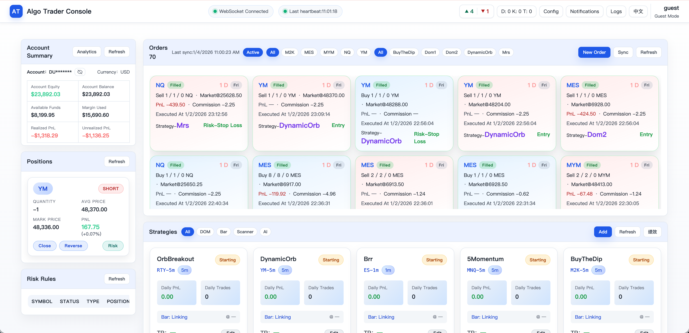

# Algo Trader for IB

[中文版](README.md)



## Project Introduction

Algo Trader for IB is a prototype automated quantitative trading platform backend built around the Interactive Brokers (IB) Gateway. The current version focuses on building backend infrastructure capabilities: adopting FastAPI as the service gateway framework, integrating unified logging, Redis message bus, in-memory task queues, database access layer, and strategy runtime configuration modules, laying the foundation for subsequent microservices architecture splitting and frontend visualization.

Project Documentation: [System Architecture Overview and Strategy Customization](docs/系统架构概述和策略定制.pdf) (Chinese)

## Technical Architecture

Sub-services such as Data implement functions like account management, order execution, and market data. Services verify service registration and message communication through Redis, and share MariaDB database for persistent data storage. At the same time, it interacts with the real trading market through IB Gateway, providing real-time market data and transaction execution capabilities.

## Roadmap

- **Short-term Goals**: Enrich strategy support and backtesting capabilities. Introduce more built-in strategy types, including market scanning strategies, AI model-driven strategies, etc., and improve the historical data backtesting framework to facilitate users in verifying strategy performance in a simulated environment.

- **Mid-term Planning**: Implement strategy hosting publishing and trading strategy market. Allow excellent strategies to be shared and traded on the platform, establishing a bridge between strategy developers and investors, forming a closed ecosystem loop. At the same time, gradually complete independent service modules such as accounts, orders, and risk control, opening up the entire process from data acquisition, strategy decision-making to execution feedback.

- **Long-term Outlook**: Expand support for more trading interfaces and asset classes. On the basis of currently docking IB US stocks/futures, add support for platforms such as digital asset exchanges (existing practice in OKX sub-projects). Adapt to different markets and data sources through plug-in architecture to improve system versatility. Continue to optimize performance and stability, improve monitoring and security mechanisms, and strive to build Algo Trader into an industry-leading open-source quantitative trading platform.

## Prerequisites

Before deploying and running Algo Trader for IB, please ensure you have the following environment and account preparations:

- **IB Account and Gateway**: You need to have a valid Interactive Brokers account and have opened the corresponding market data subscription permissions in the account (e.g., US Stock Level I real-time market data, futures market data, depth data, etc., depending on strategy needs). If the default IB Gateway port 4002 or database port 3306 is occupied locally, configuration adjustments are needed to avoid conflicts.

- **Software Dependencies**: Mainly the Docker environment. All necessary dependent services (IB Gateway, Redis, MariaDB, frontend and backend services) will be automatically deployed via Docker. If you need to run the source code yourself, a Python 3.11+ environment is required, but generally, local Python installation is not needed.

## Installation

1. **Get Code**: Clone or download this project code repository and enter the project directory:
```bash
git clone https://github.com/winglight/algo-trader-ib.git

cd algo-trader-ib
```

The current repository contains everything needed for deployment, including Docker Compose configuration, startup scripts, etc.

2. **Run Installation Script**: Execute the provided one-click deployment script to start all components:
```bash
./setup_and_run.sh
```

3. Follow the prompts to enter the IB account (Paper account only supported) password and passwords for vnc, redis, and mariadb.

After the entire initialization process is complete, the console will output messages like "Done: Middleware and service containers started". You can view the list of running containers via `docker compose ps`, and view the real-time logs of a service via commands like `docker compose logs -f backend`. If you need to stop the service, execute `docker compose down` to stop and remove containers.

## Quick Start

1. **Post-installation Setup**: After the first deployment is complete, you need to perform an IB Gateway setup and add strategies.

2. **Add Example Strategy**:
After completing the IB Gateway configuration, access the platform frontend in a browser: open `http://localhost:5173/`. After entering the Web interface, navigate to the "Strategies" panel. Click the "Add" button to create a new strategy instance. The current version has two built-in example strategy templates:

  - **Mean Reversion Strategy**: Subscribes to 1-minute and 5-minute K-line data, judges buy/sell signals based on mean reversion theory, expected trading frequency is at the minute level.

  - **DOM Structure Strategy**: Subscribes to tick-by-tick order book (DOM) data, calculates Order Book Imbalance (OBI), Order Flow Imbalance (OFI), Cumulative Volume Delta (CVD) and other market depth indicators, used to judge short-term trend direction, trading frequency can reach multiple times per minute.

 When adding a strategy, you can choose the above templates and fill in specific parameters (such as trading symbol, order quantity, etc.). After the strategy is added, the system will automatically start the strategy service, subscribe to the corresponding real-time data, and place orders according to the strategy logic.

* **Note**: The above example strategies involve K-line market data and DOM depth market data. Before use, please confirm that your IB account has subscribed to the relevant market data permissions, otherwise the strategy will not be able to receive the required data. For example, real-time market data/depth market data for US stocks/futures needs to be subscribed separately when opening an IB account. If not subscribed, you can purchase subscriptions for the corresponding data in the IB account management interface, or avoid using permissioned data sources in the strategy configuration.

3. **Verify Operation**: After the strategy starts, you can view the real-time status of each module on the frontend dashboard. For example:
* View pending/filled order records updates on the "Orders" page;
* Track strategy log output in real-time on the "Logs" page (logs will mark the belonging service and time);
* View the online status of each service and interface document aggregation on the "System Status" page (API documentation page can verify if the service is providing REST interfaces normally).


If everything is normal, you have successfully deployed and run the Algo Trader platform! The strategy will automatically trade according to the settings, and you can monitor and manage it at any time through the frontend.

## Release Log

2026-1-4 0.0.4 Released. Solved data subscription stability issues, now theoretically can run continuously. However, database table structures have changed, need to delete and rebuild.

## FAQ

- **Q: What if I cannot connect to IB Gateway or the strategy prompts a connection error?**

- **A**: If the strategy cannot connect to IB Gateway after the first run, please check if the IB Gateway's API access settings are correctly configured. Especially ensure that the "Allow connections from localhost only" restriction is turned off as described above, and the container internal IP address ranges are added. If not executed, this restriction will cause the platform container's connection request to be rejected. In addition, confirm that the TWS_USERID and TWS_PASSWORD you provided are correct. If the IB Gateway container fails to login (e.g., wrong password or account has 2FA), the strategy will not be able to get market data and place orders. You can view the IB Gateway interface via VNC to confirm if there are any login failure error prompts. If so, you need to update the correct account credentials and restart the container.

- **Q: Frontend page does not display real-time market data or strategy has no trade output?**

- **A**: If you don't see market data in the frontend dashboard or the strategy does not produce expected trades, please first confirm that the IB account has subscribed to the corresponding market data permissions (real-time market/depth market, etc.). Without permission, IB will return an error or no data. You can view the Market Data service logs on the log page for permission-related error messages. If it is a permission issue, you need to subscribe to the required data in IB account management. In addition, check if the Market Data service is running normally (whether the service is Online on the system status page), and whether the strategy is in a running state and has not triggered risk control stops. The strategy logic itself may require certain conditions to place an order, so not trading for a short time may also be a normal phenomenon.

- **Q: What if Docker containers fail to start/exit abnormally?**

- **A**: If containers fail to start normally after executing the deployment script, possible reasons include:

    - **Port Conflict**: By default, IB Gateway uses port 4002, Redis uses 6379, MariaDB uses 3306, frontend uses 5173, backend API uses 8000. If these ports are already occupied on your host, related containers may fail to start. You can modify the corresponding port mapping configuration in the `.env` or `docker-compose.yml` file in the project directory. For example, change 8000:8000 to 8001:8000, etc., and then restart.

    - **Old Data Influence**: If you have run this project before, you may encounter database initialization conflicts when running again. For example, if the MariaDB container detects an existing data volume and the root password is different, it will skip the user creation step. In this case, it is recommended to delete the `data/mariadb` directory and re-run the script, or manually enter the database container to adjust user permissions. If Redis has legacy data, you can also clear the `data/redis` directory. Cleaning up data volumes and retrying usually solves the problem.

    - **Image Download Failure**: The deployment script needs to download required Docker images from the internet. If the network is unstable, image pulling may timeout or fail. Please check the host's internet connection, run the script a few more times if necessary, or manually use `docker pull <image>` to pull failed images. After all images are ready, run the script again.

- **Q: How to modify configuration parameters such as connection info or strategy parameters?**

- **A**: Most of the platform's configuration is defined via environment variables, stored in the `.env` file in the project root directory and env files in the `config/` subdirectory for each service. You can edit these files to modify configurations. For example:

    - **Modify IB Gateway Host/Port**: Adjust `IB_GATEWAY_HOST` and `IB_GATEWAY_PORT` in `.env` (default 127.0.0.1 and 4002 respectively). If IB Gateway is deployed on another machine, change HOST to the corresponding IP and ensure network reachability.

    - **Modify Database/Redis Connection**: Adjust `REDIS_URL` or `MARIADB_URL` in `.env` to point to the new address or credentials. If you want to use an external database instead of the Docker built-in one, you can configure the connection string here.

    - **Adjust Strategy Risk Control Parameters**: If you need to modify the global stop loss ratio, risk per trade, etc., you can adjust parameters like `STOP_LOSS_RATIO`, `RISK_PER_TRADE_R` in `.env`. These parameters will take effect when the strategy runs, thereby changing the risk control behavior of the strategy.

    - After modifying configuration files, restart relevant service containers to make changes take effect (can be done via `docker compose restart <service_name>` or simply `docker compose down && docker compose up -d` to restart the entire stack). Note: Please keep sensitive information (such as passwords) safe and avoid plaintext appearing in public repositories or logs.

- **Q: Does it support adding custom strategy code? How to integrate my own strategies?**

- **A**: Yes. The Algo Trader platform is very suitable for extending custom strategies. You can encapsulate your strategy logic into a python file that meets the platform interface requirements, and then integrate it by mounting:

    - In development mode, you can directly put the strategy script into the `strategies/` directory of the project (Docker Compose has mounted the host's `./strategies` to the container's `/app/src/strategies`). Then select "Strategy Name" and fill in the corresponding strategy class path and parameters when adding a strategy on the frontend to run your strategy code.

    - The default examples provided show how strategies subscribe to data, get configurations, and generate trading instructions. You can refer to the strategy templates in the source code to write your own strategies. If you encounter problems, you can consult the project documentation or seek help in the community discussion area.

If you encounter issues not covered above during use, welcome to submit an Issue or discussion on GitHub. This project will continue to improve, looking forward to your feedback and contribution. Wish you successful trading!

Project Discussion Slack Group:
[Join Slack Group](https://join.slack.com/t/algotraderforib/shared_invite/zt-3mnrw17gh-QttZ8HNSrhmFkk9EyNnq_g)
